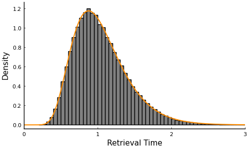

# ACTRModels

The goal of ACTRModels.jl is to provide basic functionality developing likelihood functions for the ACT-R cognitive architecture and generating simulated data. Currently, the library focuses primarily on declarative memory, but functionality can be be extended to other modules. 

# Example
The following example demonstrates how to construct an ACTR object containing declarative memory, retrieve a memory, and compute retrieval time. 

## Simulate Data

The following code block provides a simple illustration of retrieving a memory and computing retrieval time. 

```julia
using ACTRModels, Random, Plots

Random.seed!(87545)
# create chunks of declarative knowledge
chunks = [Chunk(;name=:Bob, department=:accounting),
    Chunk(;name=:Alice, department=:HR)]

# initialize declarative memory
declarative = Declarative(memory=chunks)

# specify model parameters: partial matching, noise, mismatch penalty, activation noise
Θ = (mmp=true, noise=true, δ=1.0, s=.2)  

# create an ACT-R object with activation noise and partial matching
actr = ACTR(;declarative, Θ...)

# retrieve a chunk associated with accounting
chunk = retrieve(actr; department=:accounting)
# generate a reaction time 
rt = compute_RT(actr, chunk)
```
## Log Likelihood
Now that we have generated simulated data it is possible to compute the logpdf using a lognormal race process. 

```julia
# index of retrieved chunk 
chunk_idx = find_index(chunk)
# compute activation for each chunk
compute_activation!(actr; department=:accounting)
# get mean activation
μ = get_mean_activations(actr)
# standard deviation 
σ = Θ.s * pi / sqrt(3)
# lognormal race distribution object
dist = LNR(;μ=-μ, σ, ϕ=0.0)
# log pdf of retrieval time
logpdf(dist, chunk_idx, rt)
```
## PDF Overlay

In the following code block, the PDF is superimposed on the histogram of simulated retrieval
times. Visual inspection indicates that the PDF accurately characterizes the simulated data. 

```julia
# index for accounting
idx = find_index(actr; department=:accounting)
# generate retrieval times
rts = rand(dist, 10^5)
# extract rts for accounting
acc_rts = filter(x->x[1] == idx, rts) .|> x-> x[2]
# probability of retrieving accounting
p_acc = length(acc_rts)/length(rts)
# histogram of retrieval times
hist = histogram(acc_rts, color=:grey, leg=false, grid=false, size=(500,300),
    bins = 100, norm=true, xlabel="Retrieval Time", ylabel="Density")
# weight histogram according to retrieval probability
hist[1][1][:y] *= p_acc
# collection of retrieval time values
x = 0:.01:3
# density for each x value
dens = pdf.(dist, idx, x)
# overlay PDF on histogram
plot!(hist, x, dens, color=:darkorange, linewidth=1.5, xlims=(0,3))
```

